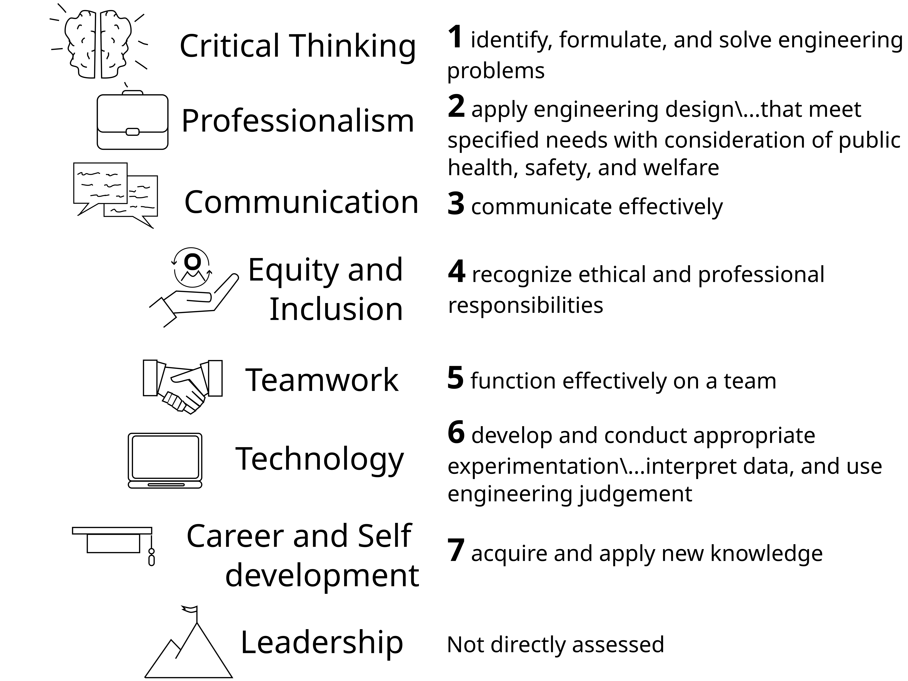
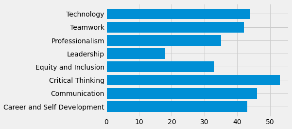
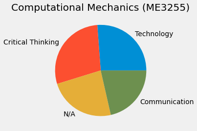
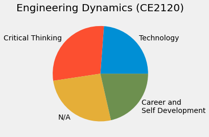

% Career Readiness in the Classroom: Integrating NACE Career Competencies 
% Ryan C. Cooper
% June 24, 2024

# Goal: 
## Increase student engagement by connecting learning outcomes to career skills

# Faculty are a primary source of career advice

- [one third of students](https://career.uconn.edu/careereverywhere/) receive career guidance from faculty
- Equity focus:
  - create career conversations in class
  - connect to students without family+friends in profession
  - address [perceived barriers]() to careers
<!-- Perceived career barriers and career decidedness of first-generation -->
<!-- college students -->

# Connecting is key to learning
- [Connections through lived
  experiences](https://www.routledge.com/The-Art-of-Changing-the-Brain-Enriching-the-Practice-of-Teaching-by-Exploring-the-Biology-of-Learning/Zull/p/book/9781579220549)
  - create new neuron paths:
  - reinforcing learning
- Education is experience

# Experiment 1: [How many soccer scores can you remember?](https://psycnet.apa.org/record/1982-09056-001)

- 62 students given soccer (football) knowledge questionaire
- asked to memorize scores from past English and Scottish matches
- the soccer knowledge questionaire was directly correlated to memorized
  score count

 
# Experiment 2: [Guided and unguided concepts]()

Groups of medical students given Instructor notes, guided+unguided

- [Guided notes increase exam scores](https://www.tandfonline.com/doi/pdf/10.2147/AMEP.S172345)
- [Too much instructor guidance can decrease
  scores](https://journals.sagepub.com/doi/pdf/10.1080/00986280701818466?casa_token=xjMx9U6_soYAAAAA:XOK_FqNKZ0V2Oxc-QIkDmSy-zFcqt6aPsjsyutYBWm_6hbb6LyitXCFCJDW78iKnXBC4rJqxqKs)

Students needed to build personal connections to material
   
# Building lived experience connections

- Instructors can scaffold connecting exercises
- Good practice for [newcomers to your field](https://firstliteracy.org/wp-content/uploads/2015/07/How-Learning-Works.pdf)
- We can't connect material to individuals' [lived experiences](https://www.taylorfrancis.com/books/mono/10.4324/9781003447313/teach-students-learn-stephanie-mcguire-saundra-yancy-mcguire-thomas-angelo)
# Students want career skills

 they are in a degree program](why_in_class.png)

#  NACE Career Competencies

# Map ABET Learning Outcomes

# Methods: Connect career skills to learning outcomes

- $\times 2$ Mechanical Engineering courses:
    - Computational Mechanics 
    - Engineering Dynamics.
- 10-15 sample connections 
- Students provide feedback in week 8 and week 15 
- 15-week semester
- week 15 optional 
- text vectorizing and k-means clustering for free response

# Result: Students connect learning to skills

On
average, students identified 5-6 career competencies that they practiced
during studying, projects, and homeworks. 

I do not directly assess
leadership and its not directly covered by ABET student outcomes, but
26% of students still connected this career competency to the course as
seen in Fig. [1](#career_comps){reference-type="ref"
reference="career_comps"}. Fig. [1](#career_comps){reference-type="ref"
reference="career_comps"} demonstrates that students were able to
connect c

ourse content to their experiences in preparing for engineering
careers. In Table [2](#table_M){reference-type="ref"
reference="table_M"}, students shared anecdotes of specific skills they
used. 

The majority of students mentioned improving critical thinking
through "problem solving" and teamwork/communication in "working with
others to improve assignments", 25% and 27% respectively.

<figure id="career_comps">

<figcaption>Mid semester connection results for students. A total of 143
students were asked to connect class to career competencies. On average
students connected 5-6 competencies to course activities, assignments,
and projects.</figcaption>
</figure>

# Clustered responses in free response text

  |response group                            |number of responses   |percent
  |-----------------------------------------| ---------------------| ---------
  work with others to improve assignments  | 55 |                   27%
  developed better problem solving         | 51 |                   25%
  communicated technical issues            | 48 |                   24%
  improved workflow with technology        | 33 |                   16%
  general self development                 | 16 |                   8%

  : Mid semester clustered free responses for students to describe 'Can
  you share an example of when you practiced or improved one of these
  career competencies in the course (this response would be great to
  share in an interview/job fair/networking event)?'

# Final voluntary ABET connection (collection)

- more than 75% of the students submitted an assignment 
- connected assignment to career skill. 

::: figure*
{height="2in"}
{height="2in"}
:::

# Conclusions: communication is key

- students are intrisically motivated to connect their experience to
  career skills 
- 75% of students completed voluntary assignments connected to careers
- The course assignments unchanged and align with ABET outcomes 
- map to NACE career competencies creates scaffold for students 
- establish vocabulary consistent between
  - administrative (ABET) goals
  - faculty goals (motivation of students) 
  - student goals (career competencies)

# Future work: reduce my work

- enable students to continuously provide feedback 
- align assignments to career skills and therefore ABET
- Here,
 monitor changes in curriculum, prerequisites, and even instructor improvements
- monitor breadth of coverage across career skills 
- skills map to ABET outcomes $\rightarrow$  continuous data collection
  of alignment and improvement

